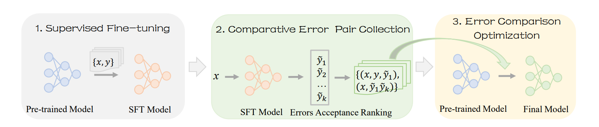
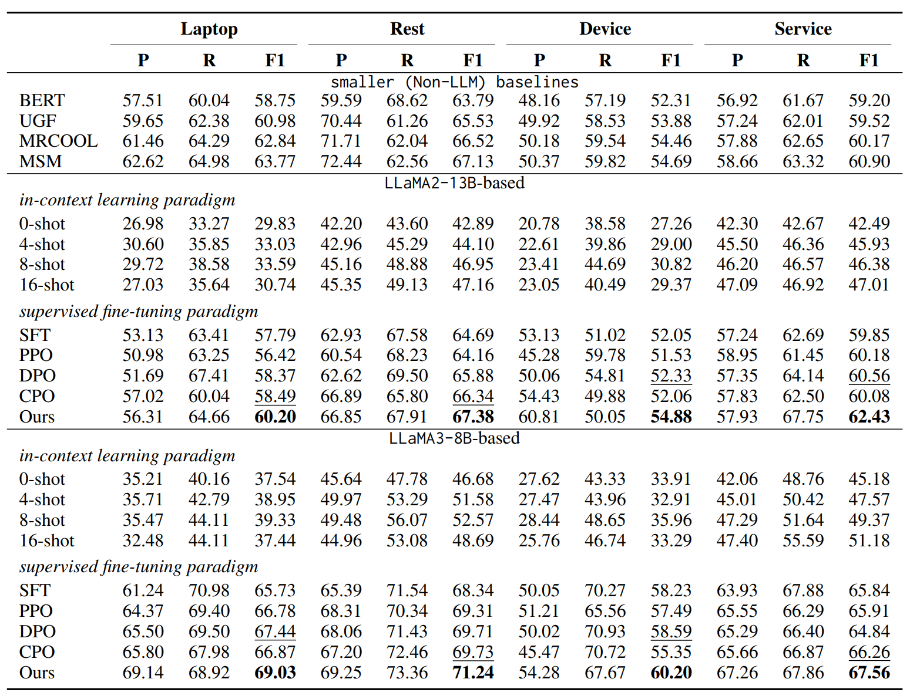
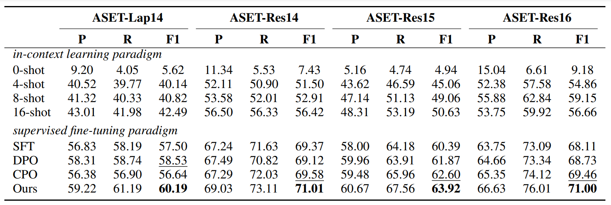
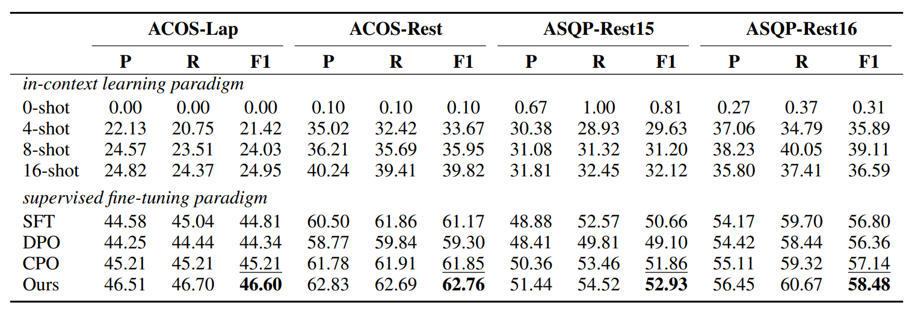

## Error Comparison Optimization for Large Language Models on Aspect-Based Sentiment Analysis


---
### Abstract
Supervised fine-tuning (SFT) has enabled large language models (LLMs) to exhibit promising performance on various tasks. However, this fine-tuning process only compares current predictions and labels on each sample, yet fails to perceive and understand its error outputs from different degrees. This poses a problem for aspect-based sentiment analysis (ABSA) in that these serious errors bring a greater negative impact than acceptable ones. **Humans tend to compare mistakes to understand the varying degrees of mistakes, thus avoiding major bad decisions.** Inspired by this, we propose a simple yet effective framework that could perceive and understand the degree of different errors by learning from comparative error pairs. We conduct comprehensive experiments on ABSA datasets to demonstrate the effectiveness of our framework over baselines.


###  Overview
<p align="center">
  
</p>

Figure shows the overview of our designed framework, which consists of three steps: 

(1) *supervised fine-tuning*, which finetunes LLMs to learn task knowledge for yielding many error outputs with similar labels and different levels; 

(2) *comparative error pair collection*, which conducts beam decoding for each sample and picks out slight and severe errors (along with labels) to form comparative error pairs; 

(3) *error comparison optimization*, which uses comparative pairs for optimization.


### Main Results
<p align="center">
  
</p>


### Generalizability Analysis
- Aspect Sentiment Triplet Extraction
<p align="center">
  
</p>

- Aspect Sentiment Quad Prediction

<p align="center">
  
</p>


---
### Cite
```
@inproceedings{wang2025error,
  title={Error Comparison Optimization for Large Language Models on Aspect-Based Sentiment Analysis},
  author={Wang, Qianlong and Ding, Keyang and Gao, Hengxin and Wang, Hui and Xu, Ruifeng},
  booktitle={Proceedings of the 63rd Annual Meeting of the Association for Computational Linguistics (Volume 1: Long Papers)},
  pages={18630--18646},
  year={2025}
}
```

